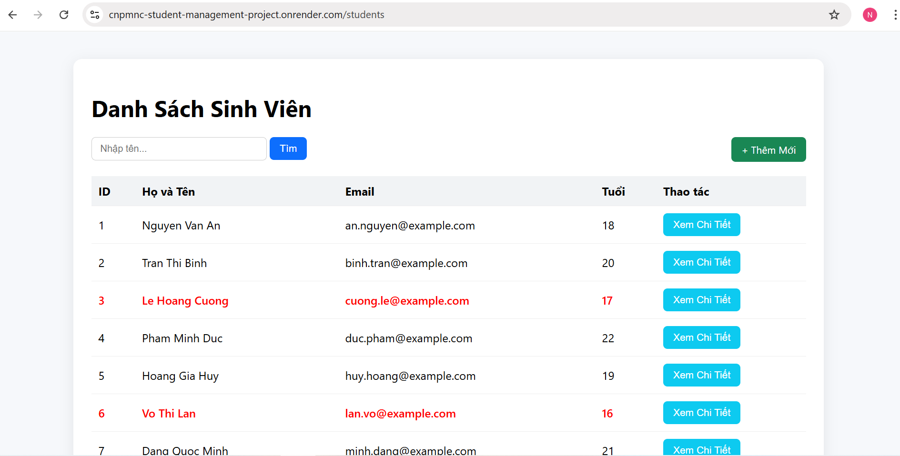
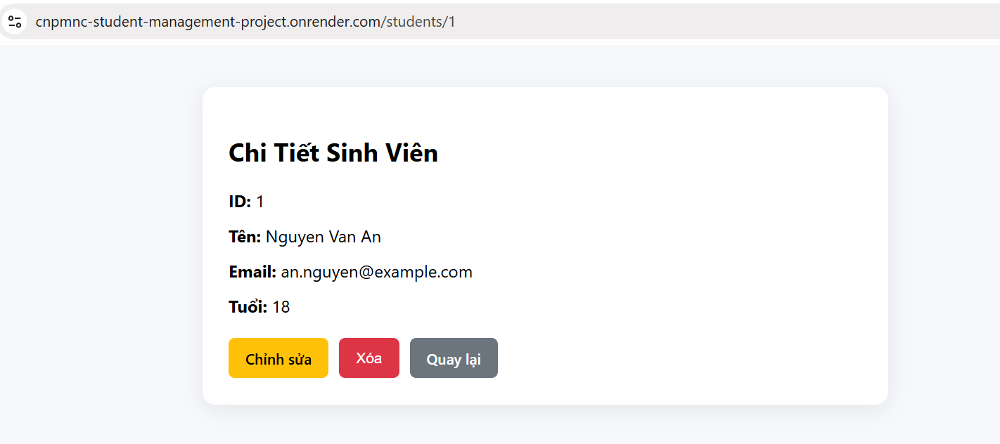
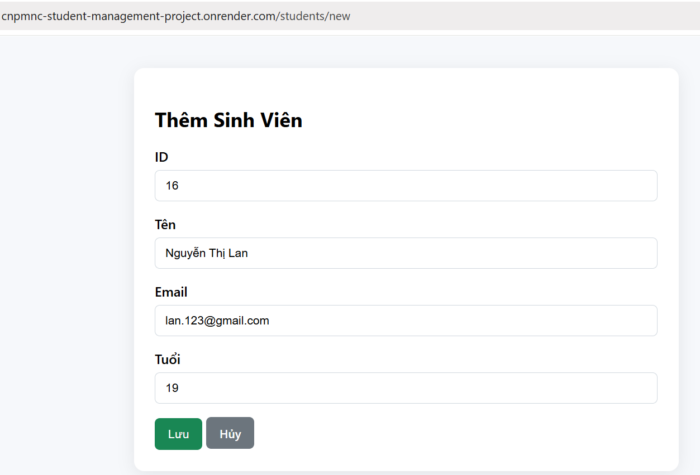
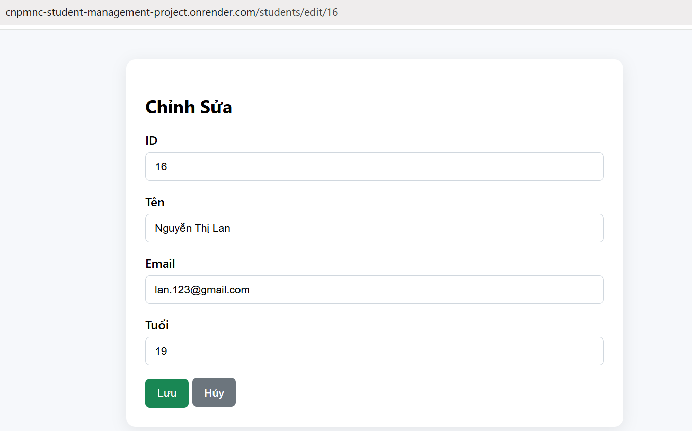
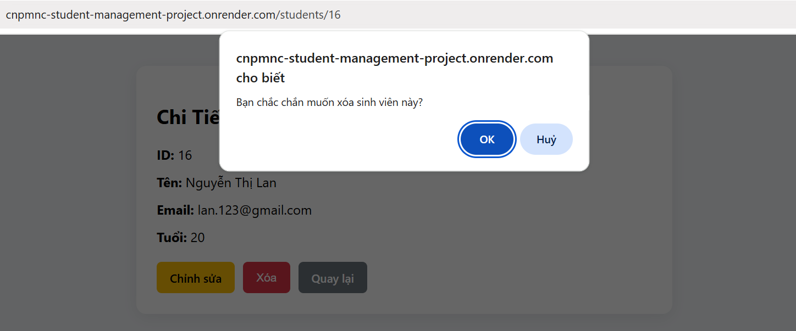
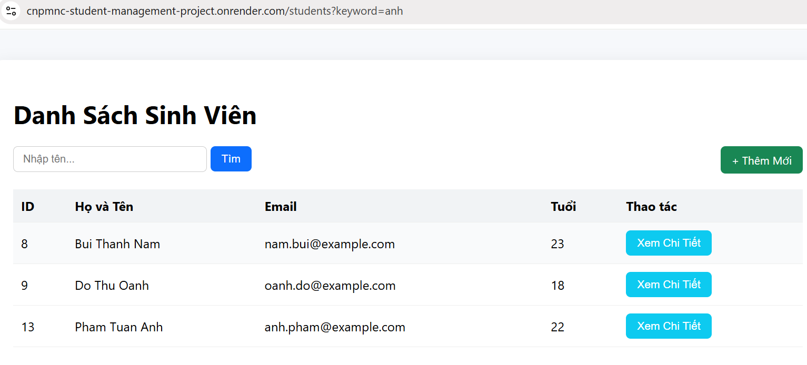

# Student Management Project

## Danh sách nhóm

|MSSV|Tên|
|---|---|
|2310365|Nguyễn Chu Nguyên Chương|
|2310393|Nguyễn Hữu Thiên Cường|

## Public Url của Web Service

> https://cnpmnc-student-management-project.onrender.com

**Lưu ý**: Vì sử dụng bản free của <a href = "https://render.com/">Render.com </a> nên có thể sẽ **mất khoảng 1 phút** để trang web hoạt động lại khi trang web không được sử dụng trong một khoảng thời gian

---

## Cách chạy dự án

### 1. Yêu cầu:
- Java Development Kit (JDK) 17+
- Build Tool: Maven
- Docker
### 2. Chạy dự án
- Chạy dự án:

        #Build dự án
        docker compose up --build

        #Chạy dự án sau khi đã build
        docker compose up
---
## Trả lời câu hỏi Lab 1

### 2. Ràng buộc Khóa Chính (Primary Key)

Khi cố tình insert một sinh viên có `id` trùng, database báo lỗi: UNIQUE constraint failed

Lý do: cột `id` được khai báo là `PRIMARY KEY`, nên mỗi giá trị phải **duy nhất** và **không được NULL**.

Database chặn thao tác này để:
- tránh trùng dữ liệu
- đảm bảo mỗi sinh viên là một bản ghi duy nhất
- tránh lỗi khi update/delete hoặc truy vấn dữ liệu

Nếu cho phép trùng khóa chính, hệ thống sẽ không xác định được bản ghi nào là đúng.

---

### 3. Toàn vẹn dữ liệu (Constraints)

Khi insert sinh viên với `name = NULL`, database **không báo lỗi** vì cột `name` không có ràng buộc `NOT NULL`.

Điều này gây rủi ro khi Java đọc dữ liệu:
- có thể nhận giá trị `null`
- dễ gây `NullPointerException`
- hiển thị dữ liệu sai
- logic chương trình bị lỗi

Thiếu ràng buộc dữ liệu làm giảm độ tin cậy của hệ thống.

---

### 4. Cấu hình Hibernate:
Tại sao mỗi lần tắt ứng dụng và chạy lại, dữ liệu cũ trong Database lại bị mất hết?

Vì trong cấu hình spring (file application.properties) có dòng `spring.jpa.hibernate.ddl-auto=create`.

Khi tắt ứng dụng và chạy lại Hibernate sẽ drop toàn bộ bảng cũ và tạo lại bảng mới &rarr; Dữ liệu cũ bị mất

---
## Screen shot các module Lab 4

### 1. Trang danh sách sinh viên

### 2. Trang chi tiết

### 3. Thêm mới sinh viên

### 4. Chỉnh sửa thông tin

### 5. Xóa sinh viên

### 6. Tìm kiếm sinh viên

